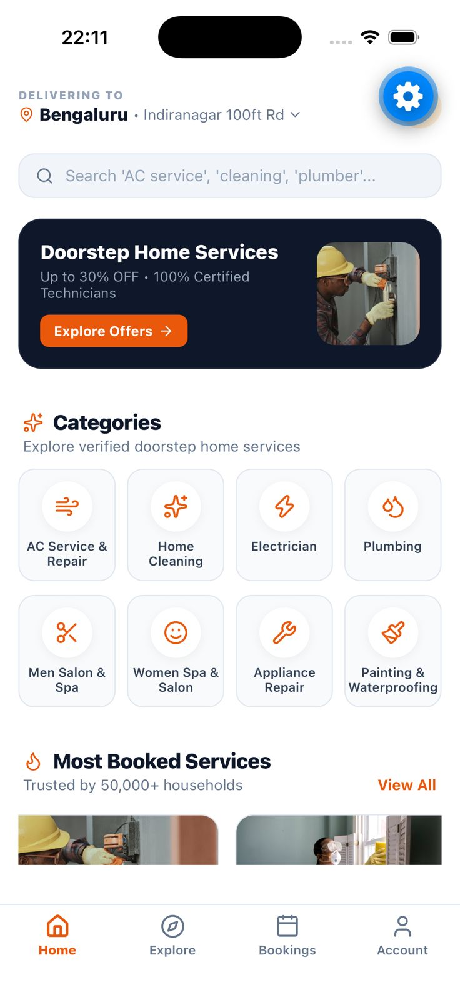
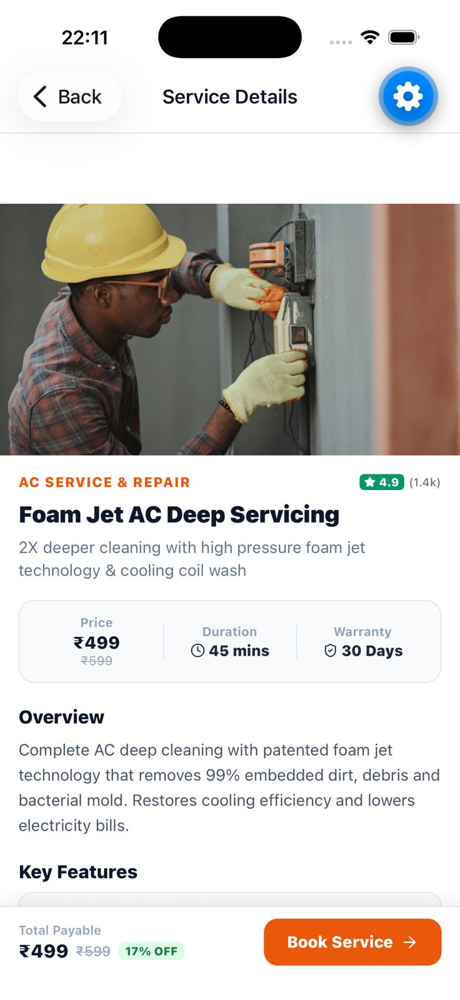
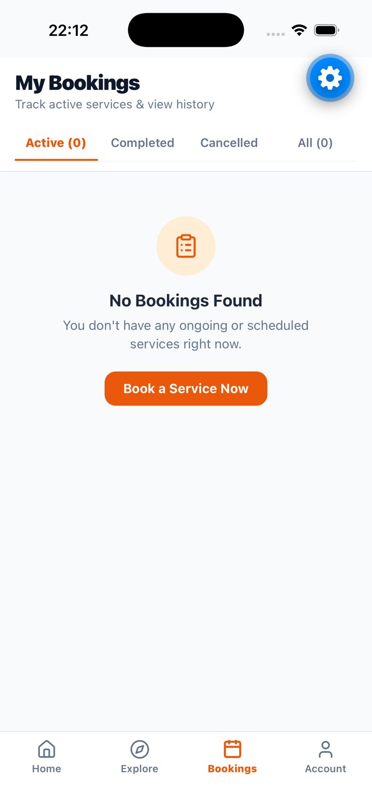
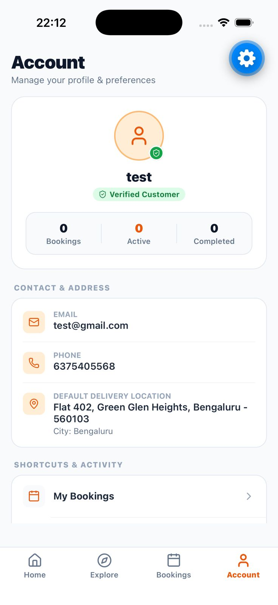

# RuralClap

Doorstep home-services booking platform — customers book verified professionals (AC service, home cleaning, electrician, plumbing, salon & spa, appliance repair, painting & waterproofing) and professionals manage and fulfil those bookings, all from mobile apps built on a shared Supabase backend.

## 1. Project Information

- **Project Title:** RuralClap – Doorstep Home Services Booking Platform
- **Category:** Software
- **Theme:** Home Services / On-Demand Marketplace

## 2. Problem Statement

Finding a verified, reliable professional for everyday home services (AC repair, cleaning, electrical work, plumbing, salon, appliance repair, painting) is fragmented and trust-deficient — customers rely on word of mouth or unverified local contacts, while independent service professionals lack a simple digital channel to reach and manage customers.

## 3. Proposed Solution

RuralClap is a two-sided marketplace with dedicated apps for each side:

- **Customer app** — browse service categories, view pricing/duration/warranty for each service, book a slot, and track bookings (active/completed/cancelled) from a single account.
- **Professional app** — receive and accept bookings, manage schedule, and fulfil doorstep service requests.

Both apps share a common backend (Supabase/Postgres) and internal packages for auth, types, and utilities, so pricing, catalog, and booking state stay consistent across customer and professional experiences.

## 4. Key Features

- Category-based service discovery (AC Service & Repair, Home Cleaning, Electrician, Plumbing, Men's Salon & Spa, Women's Spa & Salon, Appliance Repair, Painting & Waterproofing)
- Detailed service pages with price, duration, warranty, and key features
- End-to-end booking flow with active/completed/cancelled tracking
- Customer accounts with saved delivery address and booking history
- Separate professional app for accepting and managing bookings
- Multi-language support (i18n) for regional reach
- Realtime booking updates via Supabase

## 5. Technology Stack

- **Mobile apps:** React Native (Expo, Expo Router), TypeScript
- **State/data:** TanStack Query, Zustand, React Hook Form + Zod
- **Backend:** Supabase (Postgres, Auth, Row-Level Security, Realtime)
- **Monorepo tooling:** Turborepo, pnpm workspaces
- **Shared packages:** `@repo/auth`, `@repo/db`, `@repo/i18n`, `@repo/types`, `@repo/ui`, `@repo/utils`

## 6. Architecture

```text
Customer App (Expo/React Native)      Professional App (Expo/React Native)
            |                                       |
            +-------------------+-------------------+
                                |
                    Shared packages (auth, db, i18n,
                       types, ui, utils)
                                |
                                v
                  Supabase (Postgres + Auth + RLS
                        + Realtime)
```

## 7. Repository Structure

```text
sih-2026/
├── apps/
│   ├── customer/        # Customer-facing Expo app (RuralClap)
│   └── professional/    # Professional-facing Expo app
├── packages/
│   ├── auth/            # Shared authentication logic
│   ├── db/              # Supabase client & data access
│   ├── i18n/            # Localization
│   ├── types/           # Shared TypeScript types
│   ├── ui/              # Shared UI components
│   └── utils/           # Shared utilities
├── supabase/
│   └── migrations/      # Database schema & RLS policies
├── assets/
│   └── screenshots/     # App screenshots
├── package.json
├── pnpm-workspace.yaml
└── turbo.json
```

## 8. Installation

```bash
git clone https://github.com/MohitMaulekhi/sih-2026
cd sih-2026
pnpm install
```

Each app (`apps/customer`, `apps/professional`) needs its own `.env` — copy `.env.example` in that directory and fill in the Supabase project URL/anon key.

## 9. Run

```bash
# run everything via Turborepo
pnpm dev

# or run a single app
pnpm --filter customer dev
pnpm --filter professional dev
```

Database migrations live in `supabase/migrations` and apply via the Supabase CLI:

```bash
pnpm supabase db push
```

## 10. Screenshots

| Home | Service Details |
|---|---|
|  |  |

| My Bookings | Account |
|---|---|
|  |  |

## 11. Future Scope

- Payments and wallet integration
- Professional ratings/reviews and dispute resolution
- Live professional tracking for en-route bookings
- Expanded service categories and dynamic pricing by city
